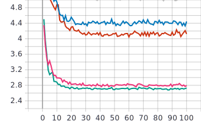
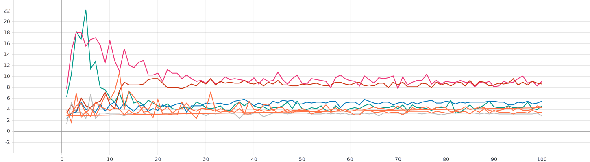
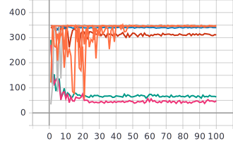
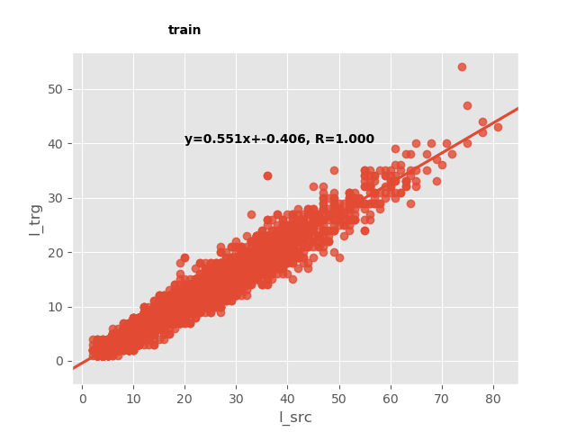
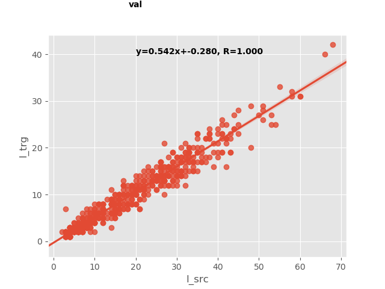
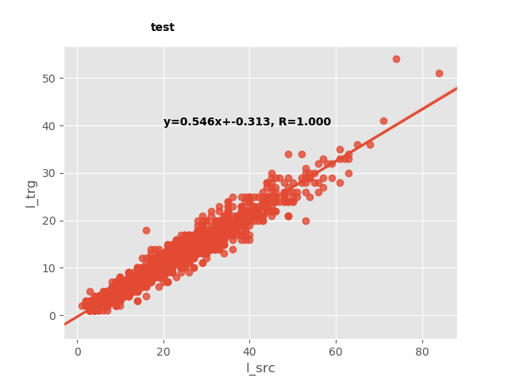

# papago_test
* [X] git config 바꿨으니까 이제 이름이 제대로 올라가겠지...?

## A. 요약
- 결과: RNNSearch 모델 greedy decoding BLEU-1 16.75, 18.08 모델을 업로드(pth)
    - 실제 어떻게 트레이닝 됐는지는 확실하지 않음 (보통 생성된 자연어를 최종점검하는데 이건 볼 수가 없어서...) 
    - {: style="width:30px"}
    - {: style="width:100px"}
    - {: style="width:30px"}

- label smoothing, beamsearch, word_drop 등을 사용해보았지만 모델구조 차이를 넘어서는 효과를 주지는 못했다 seq2seq(GRU1layer) => rnnsearch(BiGRU1layer, GRU1layer)
- translation 사용자 데이터라 가정, 언어는 미상 => **BLEU-k, METEOR, CIDEr, ROUGE-L** 을 사용하기로
- 데이터양은 많지 않지만 Supervised setting으로 진행  
    - unsupervised NLG 모델을 다뤄본 적 없음,   
    - Revisiting Low-Resource Neural Machine Translation:A Case Study에서 보기에는 supervised setting도 튜닝하기 따라 성능이 어느정도 나오는것 보고된 바 있음.
- vocab을 만들어줘야하는데... 다 실험하고 생각해보니, counting base로 하지 않았다... 왜일까 (vocab threshold =1)  
    - TOKEN: max = 658, min=0 
    - SPECIAL TOKENS: 659, 660, 661 (각각 SOS, EOS, PAD)
- src와 trg의 길이는 생각보다 일관성 있었다: 나중에 greedy decoding length heuristic으로 추가




- label smoothing 값이나 decoding length heuristic을 추가 제거하여 실험해보았지만 기대한 것과 달리 큰 변화는 관찰되지 않았다.
    - 다른 hyperparameter들과 결과론적으로 독립적이진 않은 것 같아서 무효함이 확실하진 않다 (lr=0.5, 0.3, rnnsearch model, ReduceOnPlateu, word_drop =0.1, decoding length heuristic penalty =0.1 조건에서 실험했으나 이게 최적 조건이 아니었기도 하고)


## 0. 너무 low resource 라서... 근데 그냥 아는 알고리즘들로 해보자
- Revisiting Low-Resource Neural Machine Translation:A Case Study
- 에서는 hyper parameter tuning의 효과랑 label smoothing 효과를 봤다더라
    (... 처음에 아는 알고리즘들에 이것저것 붙여서 결과뽑자고 너무 쉽게 생각했다)

## 1. seq2seq, rnnsearch, ~~transformer 정도~~ 만 만들어서 실험돌려보자
- platform 만들고 메트릭 만들고 beamsearch 만들면 내일 끝날듯?
- 그러면 내일 저녁부터는 실험걸어놓는거지...
- 그 중에 제일 좋아보이는 걸로 최종본 내면 되겠다

## 2. 최대한 서치 범위를 줄여야하므로
- learning rate 부터 건드려봄: 혹시몰라서 transformer 사용된 스케쥴러도 rnn에 써보았다
- layer는 하나로만(rnns)
- embedding, hidden 사이즈 256 통일, 데이터 스케일 비해 이것도 큰 게 아닐까하는 생각...

## 3. to-do
* [X] seq2seq
* [X] rnnsearch
* [X] metrics.py:
    - * [X] length measure l2(trg, decoded)
    - * [X] pycocoevalcap 붙임
    - * [X] stats of trg, src -> data/len.py 에 주석 + 그리고 png파일로 그려놓음
* [X] beamsearch: @MaximumEntropy 에게서 가져와서 고쳐씀
* [X] word_drop:
* [X] label_smoothing
* [X] decoding heuristic
    - * [X] no EOS, PAD, SOS until likely end length (trglen ~= 0.552srclen - 0.406)
* ~~[ ] Transformer **일단 쓰던 코드로** 써보자...~~
    ~~- * [ ] beam search with heuristic for Transformer ~~
    ~~- * [ ] greedy with heuristic **어차피 이건 나도 써야할 코드라 작성해야함**~~

* ~~[ ] main.py: eval routine~~
* [X] set-up guide!


## 4. 진척
### seq2seq는 어차피 baseline 으로 뒀으니 괜찮다고 생각했으나
- 너무 안되는거 아닌가... 심한데  
- 오늘 실험돌린게 seq2seq를 위해서는 마지막일거임
- 아 언제다하냐...Transformer 할 순 있나
- eval routine을 마련하는 건 제출을 위한 마무리단계이긴하다  
- 하지만 작성하지 못하면 완료를 못하는건 맞음

## 5. 환경 정리
```bash
nvidia-smi
##CUDA 10.1, Driver 435.21, TitanXp
+-----------------------------------------------------------------------------+
| NVIDIA-SMI 435.21       Driver Version: 435.21       CUDA Version: 10.1     |
|-------------------------------+----------------------+----------------------+
| GPU  Name        Persistence-M| Bus-Id        Disp.A | Volatile Uncorr. ECC |
| Fan  Temp  Perf  Pwr:Usage/Cap|         Memory-Usage | GPU-Util  Compute M. |
|===============================+======================+======================|
|   0  TITAN Xp            Off  | 00000000:01:00.0  On |                  N/A |
| 23%   31C    P8    12W / 250W |    518MiB / 12192MiB |      7%      Default |
+-------------------------------+----------------------+----------------------+
|   1  TITAN Xp            Off  | 00000000:07:00.0 Off |                  N/A |
| 23%   23C    P8     7W / 250W |      2MiB / 12196MiB |      0%      Default |
+-------------------------------+----------------------+----------------------+

+-----------------------------------------------------------------------------+
| Processes:                                                       GPU Memory |
|  GPU       PID   Type   Process name                             Usage      |
|=============================================================================|
|    0      2098      G   /usr/lib/xorg/Xorg                            30MiB |
|    0      2224      G   /usr/bin/gnome-shell                          96MiB |
|    0      8247      G   /usr/lib/xorg/Xorg                           269MiB |
|    0      8374      G   /usr/bin/gnome-shell                          98MiB |
+-----------------------------------------------------------------------------+


# 0. git clone
git clone https://github.com/sonsus/papago_test

# 1.conda forge
conda config --add channels conda-forge
conda config --set channel_priority strict

# 2.conda 환경구성
conda env create -f environment.yml

# 3.if need to run data/len.py
conda install matplotlib seaborn pandas


```
